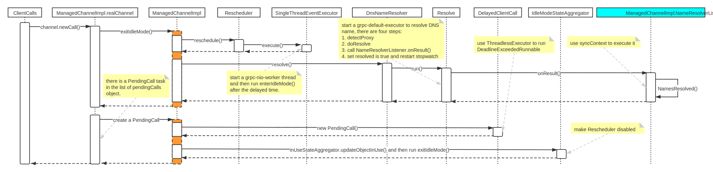
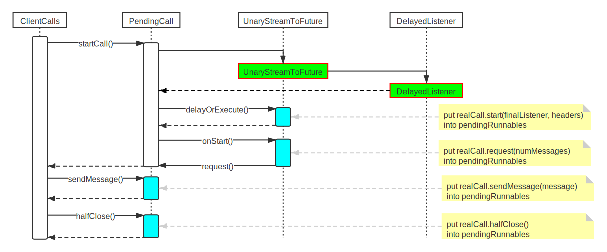
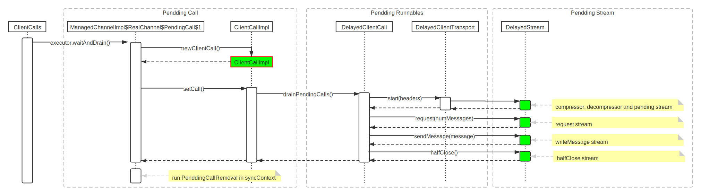

## How the gRPC client-side works

There are three parts to detail how client-side works as follows

+ Create a client call
+ Convert all operations to `Pending Runnables`
+ Execute all `Pending Runnables`

### Create a client call

In this part, you will know what we need to do before creating a client call.

### Convert all operations to `Pending Runnables`

Separate a `ClientCall` to different `Pending Runnables`.

### Execute all `Pending Runnables`

Now, the client need to execute all `Pending Runnables`.

