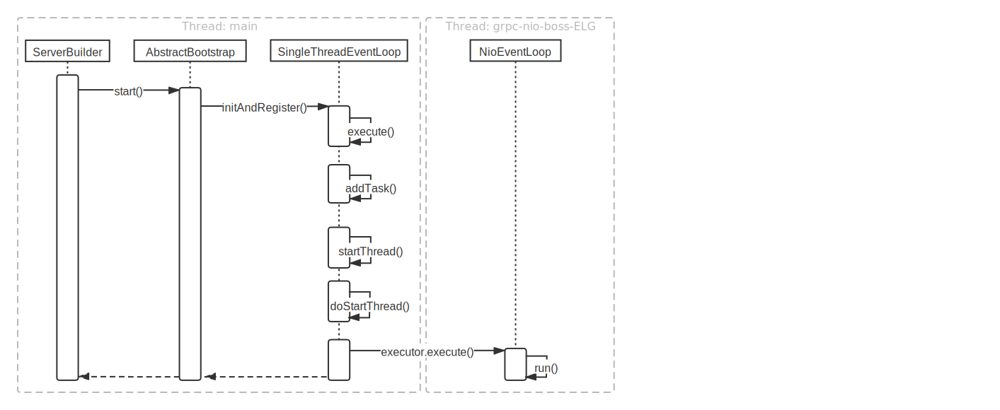
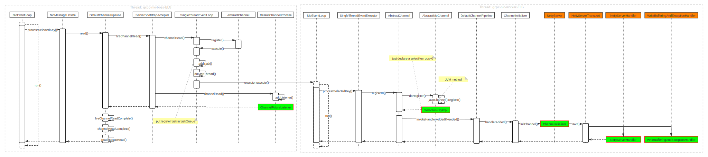
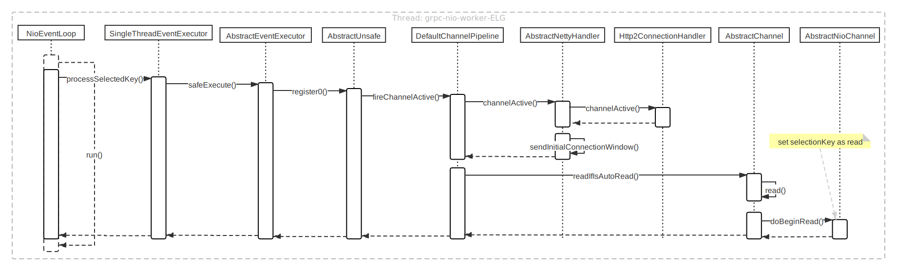
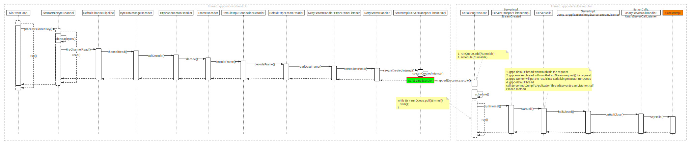
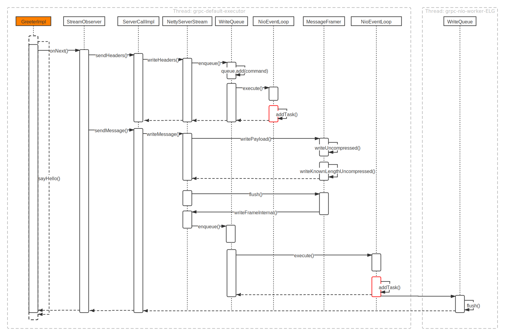

## How the gRPC server-side works

If you want to understand grpc thoroughly, you need to know netty first.

There are four parts to detail how server-side works as follows

+ Preparation in server-side
+ Establish the connection
+ Receive the request
+ Return the response

### Preparation in server-side

In this part, you will know what does the server-side need to do before receiving the client's `request`

### Establish the connection

As we all know, There must be a connection if they want to communicate each other. Here you will get details.

### Receive the request

Now, the server can receive the request sending from the client.

+ Begin read

  
+ Receive the request

  
### Return the response

gRPC returns the response after calling the Application's implementation.

