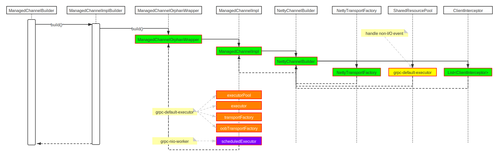

## How to build gRPC client-side

This chapter will explain how was gRPC built in client-side.

### source code
```java
/**
 * Greet server. If provided, the first element of {@code args} is the name to use in the
 * greeting. The second argument is the target server.
 */
public static void main(String[] args) throws Exception {
    String user = "world";
    // Access a service running on the local machine on port 50051
    String target = "localhost:50051";
    ......
    // Create a communication channel to the server, known as a Channel. Channels are thread-safe
    // and reusable. It is common to create channels at the beginning of your application and reuse
    // them until the application shuts down.
    ManagedChannel channel = ManagedChannelBuilder.forTarget(target)
    // Channels are secure by default (via SSL/TLS). For the example we disable TLS to avoid
    // needing certificates.
        .usePlaintext()
        .build();
    try {
        HelloWorldClient client = new HelloWorldClient(channel);
        client.greet(user);
    } finally {
        // ManagedChannels use resources like threads and TCP connections. To prevent leaking these
        // resources the channel should be shut down when it will no longer be used. If it may be used
        // again leave it running.
        channel.shutdownNow().awaitTermination(5, TimeUnit.SECONDS);
    }
}
```

### interpretation

There are three steps to build `Client`, `ManagedChannelBuilder.forTarget`, `ManagedChannelBuilder.usePlaintext` and `ManagedChannelBuilder.build` respectively.

+ ManagedChannelBuilder.forTarget()
  
+ ManagedChannelBuilder.usePlaintext()
  There are two kinds of Http2 protocol, the one is based on TLS (Https), the other is based on TCP (http).
  The client and server need to negotiate to know which http2 protocol to use.
  There are three kinds of `NegotiationType` as follows:
  - `TLS` use TLS ALPN/NPN negotiation, assumes an SSL connection.
  - `PLAINTEXT_UPGRADE` use the HTTP UPGRADE protocol for a plaintext (non-SSL) upgrade from HTTP/1.1 to HTTP/2.
  - `PLAINTEXT` just assume the connection is plaintext (non-SSL) and the remote endpoint supports HTTP/2 directly without an upgrade.
+ ManagedChannelBuilder.build()
  
  