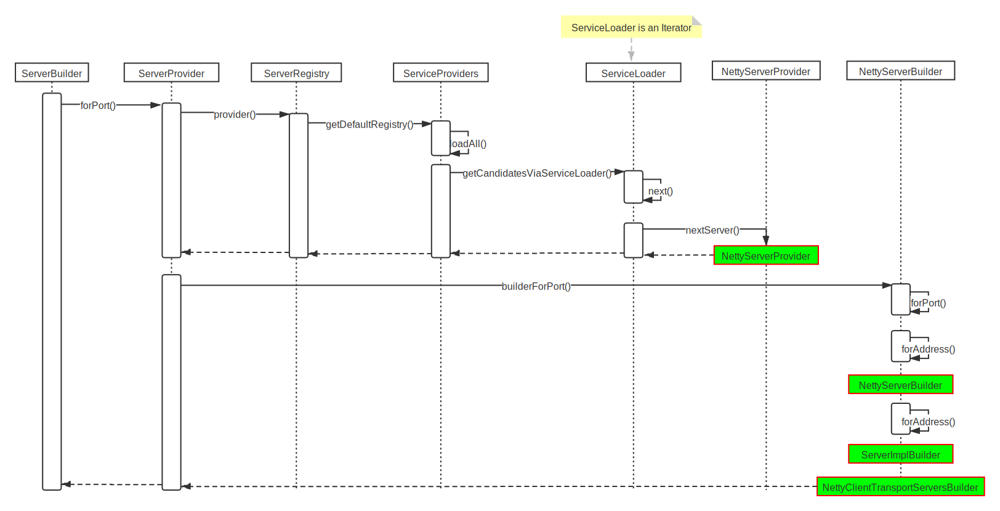
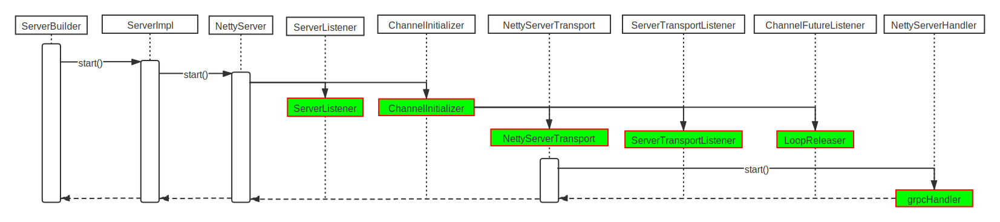

## How to build gRPC server-side

This chapter will explain how was gRPC built in server-side.

### source code
```java
private void start() throws IOException {
    /* The port on which the server should run */
    int port = 50051;
    server = ServerBuilder.forPort(port)
        .addService(new GreeterImpl())
        .build()
        .start();
  }
```

### interpretation

There are four steps to build `Server`, `ServerBuilder.forPort`, `ServerBuilder.addService`, `ServerBuilder.build` and `ServerBuilder.start` respectively.

+ ServerBuilder.forPort()
  
+ ServerBuilder.addService()
  
+ ServerBuilder.build()
  
+ ServerBuilder.start()
  
  